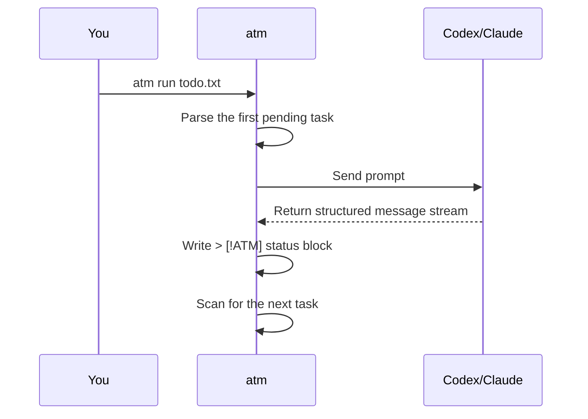

# 1. Getting Started

ATM is Agent Task Markdown. Treat it as a Markdown task-file runner: ordinary text is context or prompt content, and slash commands control loops, parallel work, conditions, and outputs.

## Install

Build from the repository root:

```sh
go build -o atm ./cmd/atm
```

ATM uses `codex` by default:

```sh
./atm todo.txt
```

Use Claude Code instead:

```sh
./atm -tool claude todo.txt
```

If the executable is outside `PATH`, pass the path explicitly:

```sh
./atm -codex /path/to/codex todo.txt
./atm -tool claude -claude /path/to/claude todo.txt
```

## First ATM File

Create `todo.txt`:

```txt
/task
Run go test ./... and fix failures.

/for 3 until tests pass
Keep fixing until the tests pass.

/go
Review README and find unclear setup instructions.

/wait

/task
Summarize the changes and verification.
```

Run it:

```sh
./atm run todo.txt
```

The default invocation is equivalent:

```sh
./atm todo.txt
```

`run` is live/rescan mode. While the run is active, ATM keeps rescanning the managed working copy. `atm append <source>` resolves to that active working file, so new task blocks can be picked up by the same run. After the run exits, `append` writes to the source file for the next run.

ATM requires an explicit source file argument. It does not search for `todo.txt`, `todo.md`, or `toto.md` automatically.

## What Happens



After execution, `~/.atm/runs/<run-id>/result.todo.md` contains generated status blocks:

```txt
/task
Run go test ./... and fix failures.
> [!ATM]
> status: done
> started: 2026-05-21 10:00
> finished: 2026-05-21 10:02
> duration: 2m
> runs: 1x
>
> messages:
> - assistant (codex):
>   Fixed the failing tests.
```

## Preview A Plan

Inspect execution before running:

```sh
./atm check --plan todo.txt
```

The plan shows each task's IR flow:

```txt
task 2:
  flow: For(n in [0 1 2]) -> Execute
  prompt: Keep fixing until the tests pass.
```

## Run Directory

Direct runs write to `~/.atm/runs/<run-id>/` by default:

```txt
~/.atm/runs/20260521-103000-a1b2c3d4/
  manifest.json
  sources/
    todo.txt
  work/
    todo.txt
  result.todo.md
  tasks/
    <task-id>/
      report.md
      logs/
  outputs/
```

Choose a shared output directory:

```sh
./atm run todo.txt -output .atm/release-check
./atm run todo.txt -o .atm/release-check
```

`result.todo.md` is the final status snapshot. The original source file is restored to its pre-run content when the run exits. Detailed reports and logs live under `tasks/<task-id>/`.
