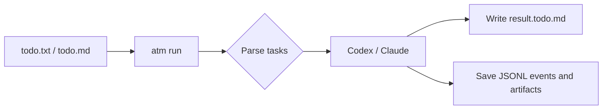

# ATM User Manual

[中文](../../zh/user/README.md)

ATM means **Agent Task Markdown**: a Markdown-based DSL for scheduling agent tasks. Ordinary Markdown carries background, plans, and notes. `/task`, task header commands, and slash control commands declare executable tasks, loops, parallel branches, conditions, structured outputs, and reusable definitions.

This manual is for daily ATM use. It starts with the first `todo.txt`, then covers task boundaries, workflows, reusable definitions, task databases, result artifacts, and release-style runbooks.

## Contents

1. [Getting Started](01-getting-started.md)
2. [ATM Files And Task Boundaries](02-todo-format.md)
3. [Workflows: Loops, Parallelism, And Pools](03-workflows.md)
4. [Reuse: Definitions, Calls, Returns, And Imports](04-reuse.md)
5. [Structured Output, Status Blocks, And Artifacts](05-results.md)
6. [Task Databases: Memory, Blackboard, And Permissions](06-databases.md)
7. [Patterns And Complete Examples](07-patterns.md)
8. [Command Manual](reference/commands.md)
9. [CLI Manual](reference/cli.md)
10. [Environment Variables](reference/environment.md)

## What ATM Is For

ATM is a "Markdown file as execution queue" tool for coding agents. You write tasks as plain text or Markdown, ATM sends them to Codex or Claude in order, and the result document is saved in a managed run directory while the original source file stays unchanged.

## Minimal Model

| Concept | Rule |
| --- | --- |
| Task block | Prompt text starting at `/task`, a task-start control command, or a task header command followed by prompt text |
| Command | Written at the start of a task; controls how that task runs |
| `/go` | Start a task in the background and continue scanning |
| `/wait` | Wait for earlier background tasks |
| `/for` | Loop, retry, or iterate over files, directories, ranges, or lists |
| `/output` | Save text or structured JSON output |
| `/db` | Expose a local JSON database to the agent as memory or a blackboard |
| `/def` + `/call` | Define reusable task templates and call them when needed |

Start with [Getting Started](01-getting-started.md), then jump to the chapter that matches your workflow.
