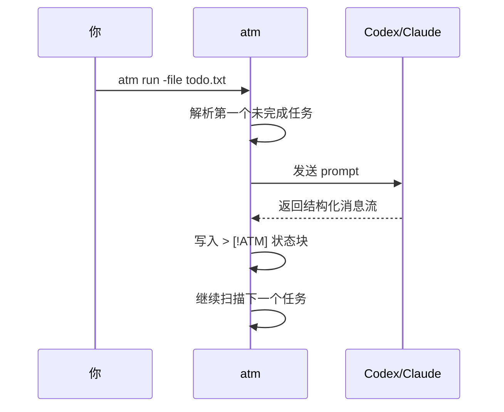

# 1. 快速开始

ATM 是 Agent Task Markdown。你可以先把它当成一个 Markdown 任务文件执行器：普通段落是发给 agent 的任务，斜杠命令控制循环、并行、条件和输出。

## 安装

在仓库根目录构建：

```sh
go build -buildvcs=false -o atm ./cmd/atm
```

运行时默认使用 `codex`：

```sh
./atm -file todo.txt
```

如果要使用 Claude Code：

```sh
./atm -tool claude -file todo.txt
```

可执行文件不在 `PATH` 中时，显式指定路径：

```sh
./atm -codex /path/to/codex -file todo.txt
./atm -tool claude -claude /path/to/claude -file todo.txt
```

## 第一个 todo 文件

创建 `todo.txt`：

```txt
运行 go test ./...，修复失败。

/for 3 until tests pass
继续修复，直到测试通过。

/go
审查 README，找出安装说明不清楚的地方。

/wait

总结本次修改和验证结果。
```

执行：

```sh
./atm run -file todo.txt
```

也可以省略 `run`：

```sh
./atm -file todo.txt
```

没有传文件时，ATM 会依次查找：

1. `todo.txt`
2. `todo.md`
3. `toto.md`

## 发生了什么



执行完成后，todo 文件会出现生成状态块：

```txt
运行 go test ./...，修复失败。
> [!ATM]
> status: done
> started: 2026-05-21 10:00
> finished: 2026-05-21 10:02
> duration: 2m
> runs: 1x
>
> messages:
> - assistant (codex):
>   已修复测试失败。
```

## 预览计划

执行前可以先看计划：

```sh
./atm plan -file todo.txt
```

输出会展示每个任务的 IR 流程，例如：

```txt
task 2:
  flow: For(N in [1 2 3]) -> Execute
  prompt: 继续修复，直到测试通过。
```

## 产物目录

每次运行默认写入 `.atm/YYYYMMDDHHMMSS[-N]`：

```txt
.atm/20260521103000/
  task-001-....log
  task-001-run-001-codex.jsonl
  result.md
```

手动指定目录：

```sh
./atm run -file todo.txt -output .atm/release-check
./atm run -file todo.txt -o .atm/release-check
```

`result.md` 是执行结束时 todo 文件的快照，便于之后执行 `untag` 清理状态后追查历史。
