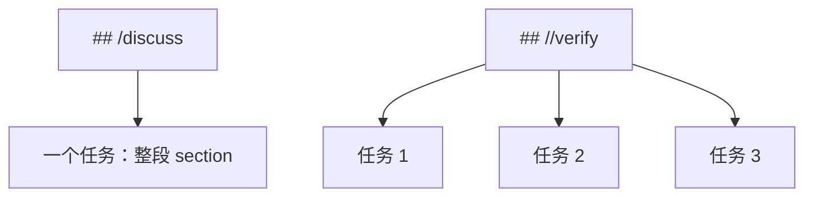

# 2. Todo 文件与任务边界

ATM 是 Agent Task Markdown，核心输入是一份 Markdown/纯文本任务文件。它支持两种写法：旧式文本块和 Markdown task mode。选择哪一种取决于你是否需要在同一份文档中保留大量说明文字。

## 旧式文本块

没有 slash heading 时，ATM 使用旧式文本块模式。空行分隔任务：

```txt
第一个任务。

第二个任务。

/go
第三个任务，后台运行。
```

任意数量的空行都可以分隔任务，包括只包含空格的空行。

## 注释与分隔线

旧式任务块和 `//` task-list section 中，以下行会被忽略：

```txt
# 整行注释
   # 前面有空格也可以
<!-- HTML 注释 -->
[//]: # (Markdown 引用式注释)
[comment]: <> (Markdown 引用式注释)
---
===
```

注意：只识别整行注释。下面这行不是注释，`#` 会作为 prompt 内容发送：

```txt
请解释 package # 这里仍然是 prompt 内容
```

## Markdown task mode

如果文档中出现任意 slash heading，ATM 只执行 slash heading section，普通 Markdown section 保留为说明文字。

```md
# 发布背景

这里是说明文字，不执行。

## //verify

运行 go test ./...，修复失败。

运行 go vet ./...，修复可操作问题。

## /discuss

这里整个 section 是一个 prompt。

空行会保留在 prompt 中。
```

## `/` 和 `//` 的区别

| Heading | 语义 | 空行作用 | 适合场景 |
| --- | --- | --- | --- |
| `# /name` | 整个 section 是一个任务 | 保留为空行 | 长 prompt、带段落的讨论 |
| `# //name` | section 内是多个旧式任务块 | 分隔任务 | 检查清单、批量任务 |

图示：



## 命令必须写在任务开头

任务命令只在 prompt 开始前识别：

```txt
/for 3
修复测试。
```

prompt 开始后的 slash 文本会当作普通 prompt：

```txt
解释下面这行：
/for 3
```

例外是正文独立行 `/call name ...`。它是内联调用点，会先调用定义，把返回值嵌入 prompt，再执行外层任务。详见 [复用任务](04-reuse.md)。

## 格式化

整理生成状态：

```sh
atm format -file todo.txt
```

移除生成状态：

```sh
atm untag -file todo.txt
```

保留 done，只移除 running：

```sh
atm untag -file todo.txt -done=false
```
