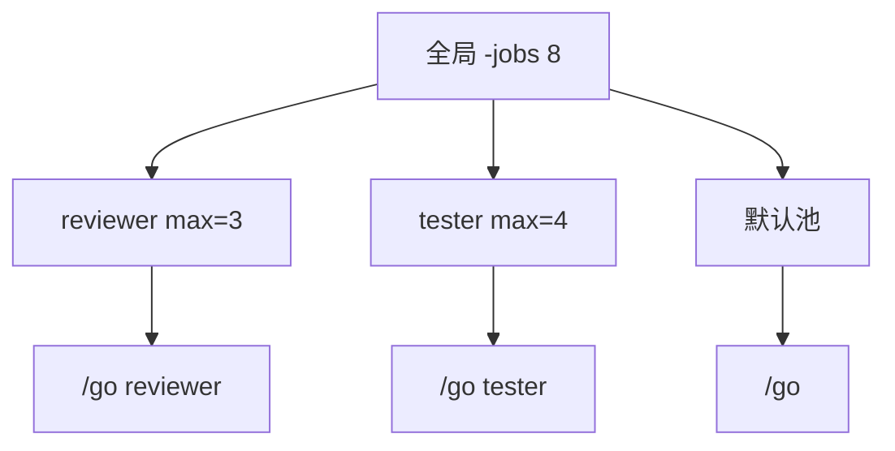

# 3. 执行流程：循环、并行与工作池

ATM 的执行器按 IR 顺序解释命令。理解 `/for`、`/go`、`/wait` 的顺序，是写清晰工作流的关键。

## 顺序任务

```txt
运行测试并修复失败。

运行 go vet ./...，修复可操作问题。

总结修改。
```

ATM 从上到下执行，每个任务完成后才进入下一个。

## 循环与重试

固定次数：

```txt
/for 3
第 {{N}} 次审查最终 diff。
```

带条件的重试：

```txt
/for 3 until tests pass
修复测试失败。
```

每次执行后，ATM 会让所选工具报告条件是否满足；这部分交互由 ATM 自动处理。

如果 `until` 后面是括号表达式，ATM 会把它当成 CEL，在本地做确定性判断：

```txt
/for 5 until(exists("result.json") && len(read("result.json")) > 0)
生成 result.json。
```

也可以不写次数，让循环一直运行到 CEL 条件满足：

```txt
/for until(exists("result.json") && json("result.json").passed)
持续修复，直到 result.json 中 passed=true。
```

无界形式只支持 CEL，不支持自然语言判断。文件路径要写成字符串，例如 `read("result.json")`。

## 条件分支

`/if` 和可选的 `/else` 用 CEL 在本地选择任务块：

```txt
/if (exists("gate.json") && json("gate.json").passed)
继续发布。

/else
写发布阻塞说明。
```

未选中的块会被写成 `> [!ATM] status: skipped`，所以后续扫描不会再执行它。`/if` 是任务块级控制流，不是 prompt 内的模板语法。

`/if(...)` 使用本地 CEL；`/if 自然语言条件` 会走 agent 的 MCP check：

```txt
/if 发布门禁已经打开
继续发布。
```

嵌套时使用 header-only 形式，并且必须成对写 `/else`。没有缩进时，`/else` 永远匹配最近一个还没匹配的 header-only `/if`：

```txt
/if (exists("gate.json"))

/if (json("gate.json").passed)

发布。

/else
写门禁失败说明。

/else
先生成 gate.json。
```

## 文件、目录和列表循环

```txt
/for dir
审查目录 {{dir}}。

/for path
审查文件 {{path}}。

/for area in [api docs tests]
审查 {{area}}。
```

## 后台任务

```txt
/go
审查 README。

/go
审查 docs/commands.md。

/wait

汇总两个审查结果。
```

图示：

```mermaid
gantt
  title /go 和 /wait
  dateFormat X
  axisFormat %s
  README review :a, 0, 4
  commands review :b, 0, 5
  wait :milestone, 5, 0
  summary :c, 5, 2
```



## `/for /go` 与 `/go /for`

命令顺序有语义差异。

```txt
/for area in [api docs tests] /go
审查 {{area}}。
```

这会启动多个后台分支，每个循环项一个 agent 分支。

也可以从 planner 返回的数组动态展开。最简单模式是不落盘：`/for item in(/call planner)` 直接调用 planner，并展开返回对象里的 `plans` 数组：

```md
## /def plan_shards

规划本次发布需要并行审查的工作项。
每个计划包含审查人、负责人、重点问题和相对于 ./result 的写目录。

/return
```
plans:[]string:计划
```

## //parallel review

/for plan in(/call plan_shards)
/go reviewer
{{plan}}

/wait reviewer
```

动态 `/for` 在运行期读取表达式结果，因此适合 “planner 先返回数组，worker 再 fan-out” 的模式。需要审计或跨任务复查时，再把 planner 结果用 `/output` 保存到文件并通过 `jsonOutput(...)` 读取。`in (...)` 和 `in(...)` 都支持；推荐控制流换行写，简单 `/let name value` 或 `/let name /call def` 仍用单行。

```txt
/go /for 3
审查第 {{N}} 轮。
```

这会启动一个后台分支，循环留在该分支内部顺序执行。

## 工作池 `/pool`

声明具名工作池：

```txt
/pool reviewer 3
```

把后台任务提交到池：

```txt
/for area in [api docs tests ux] /go reviewer
审查 {{area}}。

/wait reviewer
```

`/pool reviewer 3` 表示 reviewer 池最多同时运行 3 个后台分支。默认队列无限。限制额外排队容量：

```txt
/pool reviewer 3 10
```

所有池都受全局并发限制 `-jobs` 约束：

```sh
atm run -file todo.txt -jobs 8
```



## 推荐模式

发布检查示例：

```txt
/pool reviewer 3

/bash go test ./...
确认测试结果，修复失败。

/for area in [api docs observability] /go reviewer
审查 {{area}} 的发布风险。

/wait reviewer

/for 2 until release notes are accurate
更新发布说明，直到准确。
```

经验规则：

- 会修改同一批文件的任务尽量顺序执行。
- 只读审查、文档检查、独立模块分析适合 `/go`。
- 并发数量优先用 `/pool` 和 `-jobs` 限制，不要让 agent 数量失控。
