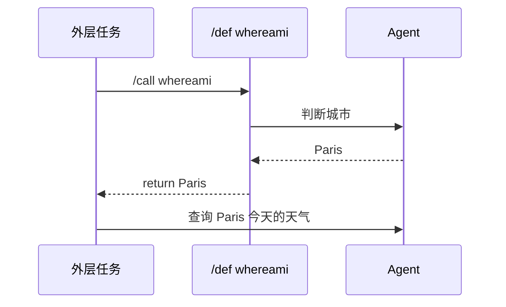

# 4. 复用任务：定义、调用、返回值与导入

当多个任务有相同结构时，用 `/def` 定义任务模板，再用 `/call` 调用。第一版模型是“运行时内联调用”：调用点会真正执行定义，必要时拿到返回值，再继续外层任务。

## 单任务定义 `/def`

Markdown 写法：

```md
## /def whereami

根据仓库上下文判断当前城市。只返回城市名。

/return {{agent.last_message}}
```

调用并忽略返回值：

```txt
/call whereami
```

在 prompt 中内联返回值：

```txt
查询
/call whereami
今天的天气。
```

ATM 会先执行 `whereami`，把 `/call whereami` 这一行替换成返回文本，再执行外层 prompt。



## 多任务定义 `//def`

`//def` 内部按旧式任务块拆分，调用时顺序执行多个块：

```md
## //def release_reviews area

/pool reviewer 2

/go reviewer
审查 {{area}} 的实现风险。

/go reviewer
审查 {{area}} 的文档风险。

/wait reviewer

/return
{{area}} 审查完成。
最近结论：
{{agent.last_message}}
```

调用：

```txt
/let checkout_review /call release_reviews checkout
总结审查结果：
{{checkout_review}}
```

定义内部可以使用 `/pool`、`/go`、`/wait`。定义内声明的 pool 只在本次调用中局部生效，同时仍受全局 `-jobs` 限制。

## 参数

参数按位置绑定：

```md
## /def review_area area severity

以 {{severity}} 严重度审查 {{area}}。

/return {{agent.last_message}}
```

调用：

```txt
/call review_area api high
```

参数值会先按调用点变量渲染：

```txt
/let target api
/call review_area {{target}} high
```

## 返回值 `/return`

单行返回：

```txt
/return {{city}}
```

bash 返回：

```txt
/return /bash git branch --show-current
```

多行返回：

```txt
/return
当前分支：{{branch}}
最近消息：{{agent.last_message}}
```

结构化返回：

````txt
判断发布门禁是否通过。

/return
```json
{
  "type": "object",
  "required": ["passed", "reason"],
  "properties": {
    "passed": {"type": "boolean"},
    "reason": {"type": "string"}
  }
}
```
````

`/return` 模板可以读取当前定义调用的最近 assistant 消息：

| 表达式 | 含义 |
| --- | --- |
| `{{agent.message}}` | 最近一条 assistant 消息，等同于 `{{agent.last_message}}` |
| `{{agent.last_message}}` | 最近一条 assistant 消息 |
| `{{agent.messages}}` | 最近 N 条 assistant 消息拼接文本 |
| `{{agent.messages_json}}` | 最近 N 条消息的 JSON 字符串 |

N 使用 `atm run -messages N`，默认是 `1`。

这些 `agent.*` 值只在 `/return` 渲染时存在，不是普通 prompt 的全局变量。原因是普通 prompt 渲染发生在 agent 执行之前，还没有 assistant 消息可读。要在后续 prompt 中使用 agent 消息，请通过 `/return` 返回，再用 `/let name /call ...` 绑定：

```txt
/let review_note /call reviewer api
根据审查消息继续处理：
{{review_note}}
```

## `/output` 作为 fallback 返回值

如果定义没有 `/return`，但有结构化 `/output`，结构化 JSON 会成为 fallback 返回值。作为返回值时 `/return` 优先级高于 `/output`；`/output` 更适合把结果保存成文件，`/return` 更适合把结果交给调用方继续渲染。

````md
## /def check_release

判断发布是否可以继续。

/output result
```
passed:boolean:是否通过
reason:string:原因
```
````

调用并访问字段：

```txt
/let gate /call check_release

根据 {{gate.passed}} 和 {{gate.reason}} 写发布建议。
```

如果只是想把 agent 的普通文本保存到文件，不需要 schema：

```txt
写一份发布经理可以直接转发的风险说明。

/output release-note
```

如果定义既没有 `/return` 也没有 `/output`，它没有返回值。作为独立任务调用可以；但在 `/let name /call ...` 或 prompt 内联 `/call` 中会失败。

## 把定义暴露成 MCP 工具

普通 `/call` 由 ATM 在执行流程中同步展开。如果希望 agent 在一个较大的任务中自行决定何时调用某个定义，可以用 `/mcp def use`：

```txt
/def inspect_area area
审查 {{area}} 的发布风险。

/return {{agent.last_message}}

/cd work/release
/mcp def use inspect_area
分别审查 api 和 docs。每个区域都调用一次可用的 ATM definition MCP tool，然后汇总风险。
```

ATM 会为选中的定义挂载临时 MCP server。上例会暴露工具 `atm_def_inspect_area`，输入 schema 包含一个 required string 参数 `area`。tool 返回 JSON 文本，其中 `value` 是定义的返回值。

通过 def-MCP 调起的定义会继承当前任务的 `/cd` 工作区、可见 `/db`、已启用 skill 和已启用 MCP。为了避免 agent 自递归调度，def-MCP 调起的内层 agent 默认不会继续获得 def-MCP 工具；定义内部仍然可以正常使用静态 `/call`。

完整样例见 [examples/zh-CN/def-mcp-skill.todo.md](../../examples/zh-CN/def-mcp-skill.todo.md)。

## 导入定义

只导入定义，不执行被导入文件中的普通任务：

```txt
/import workflows/location.todo.md
/import weather from workflows/weather.todo.md
```

无命名空间：

```txt
/call whereami
```

带命名空间：

```txt
/call weather.lookup Paris
```

导入路径相对当前 todo 文件。ATM 会检测递归调用，包括跨文件形成的环：

```txt
a -> b -> c -> a
```

这会在 plan/parse 阶段报错，而不是运行到一半无限展开。

## 完整例子

```md
# 发布日任务

## /def current_city

判断当前用户所在城市。只返回城市名。

/return {{agent.last_message}}

## //def review_area area

/pool reviewer 2

/go reviewer
审查 {{area}} 实现风险。

/go reviewer
审查 {{area}} 文档风险。

/wait reviewer

/return
{{area}} 审查完成。
最近消息：{{agent.last_message}}

## /weather_note

为
/call current_city
写一段发布日天气提醒。

## //release_reviews

/let checkout /call review_area checkout
总结：
{{checkout}}
```
