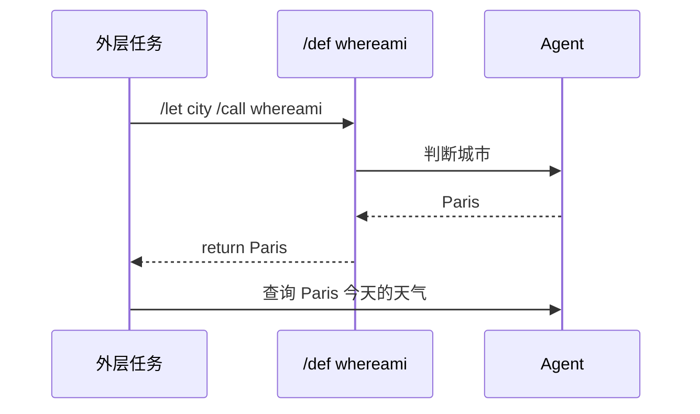

# 4. 复用任务：定义、调用、返回值与导入

当多个任务有相同结构时，用 `/def` 定义任务模板，再用 `/call` 调用。`/call` 只在任务/header 命令位置执行；prompt 正文中的 slash 文本不会执行。需要把返回值写进 prompt 时，先用 `/let name /call ...` 绑定，再渲染变量。这个绑定是懒执行的：变量未被读取时不会调用 definition；同一次任务调用内读取多次只执行一次。

## 定义 `/def`

定义从 `/def name [params...]` 开始，必须用唯一的 `/return` 结束。Heading 只是文档结构，不再定义任务模板。

`/def` 采用 Markdown 词法作用域。文档根部的定义对整篇文档后续任务可见；某个 heading 下的定义只对该 heading 的后续任务和子 heading 可见，不会泄漏到同级 heading。需要多个同级章节复用时，把定义放在共同父级的任务之前，或者直接放在文档根部。定义不会前置提升，因此任务不能调用文档后面才出现的 `/def`。

```md
/def whereami

根据仓库上下文判断当前城市。只返回城市名。

/return {{agent.last_message}}
```

调用并忽略返回值：

```txt
/call whereami
```

在 prompt 中使用返回值：

```txt
/let city /call whereami
查询 {{city}} 今天的天气。
```

ATM 会在渲染 `{{city}}` 时执行 `whereami`，把返回值绑定到 `city` 并缓存，再执行外层 prompt。



## 多任务定义

`/def` 内部可以包含多个普通 task block，调用时顺序执行这些内部任务，最后由 `/return` 返回值：

````md
/def release_reviews area

/pool reviewer 2

/go reviewer
审查 {{area}} 的实现风险。

/go reviewer
审查 {{area}} 的文档风险。

/wait reviewer

/return
```
{{area}} 审查完成。
最近结论：
{{agent.last_message}}
```
````

调用：

```txt
/let checkout_review /call release_reviews checkout
总结审查结果：
{{checkout_review}}
```

定义内部可以使用 `/pool`、`/go`、`/wait`。定义内声明的 pool 只在本次调用中局部生效，同时仍受全局 `-jobs` 限制。

## 参数

参数按位置绑定：

```md
/def review_area area severity

以 {{severity}} 严重度审查 {{area}}。

/return {{agent.last_message}}
```

调用：

```txt
/call review_area api high
```

参数值会先按调用点变量渲染：

```txt
/let target api
/call review_area {{target}} high
```

## 返回值 `/return`

单行返回：

```txt
/return {{city}}
```

bash 返回：

```txt
/return /bash git branch --show-current
```

多行返回：

````txt
/return
```
当前分支：{{branch}}
最近消息：{{agent.last_message}}
```
````

bash 也可以使用 fenced script 参数：

````txt
/return /bash
```
git branch --show-current
```
````

`/return` 后不能直接跟裸多行文本；多行文本必须放在 fenced block 中。

结构化返回：

````txt
判断发布门禁是否通过。

/return
```json
{
  "type": "object",
  "required": ["passed", "reason"],
  "properties": {
    "passed": {"type": "boolean"},
    "reason": {"type": "string"}
  }
}
```
````

`/return` 模板可以读取当前定义调用的最近 assistant 消息：

| 表达式 | 含义 |
| --- | --- |
| `{{agent.message}}` | 最近一条 assistant 消息，等同于 `{{agent.last_message}}` |
| `{{agent.last_message}}` | 最近一条 assistant 消息 |
| `{{agent.messages}}` | 最近 N 条 assistant 消息拼接文本 |
| `{{agent.messages_json}}` | 最近 N 条消息的 JSON 字符串 |

N 使用 `atm run -messages N`，默认是 `1`。

这些 `agent.*` 值只在 `/return` 渲染时存在，不是普通 prompt 的全局变量。原因是普通 prompt 渲染发生在 agent 执行之前，还没有 assistant 消息可读。要在后续 prompt 中使用 agent 消息，请通过 `/return` 返回，再用 `/let name /call ...` 绑定：

```txt
/let review_note /call reviewer api
根据审查消息继续处理：
{{review_note}}
```

## `/output` 与返回值

Definition 必须显式写 `/return`。如果需要返回结构化 JSON，应写结构化 `/return`；不要依赖结构化 `/output` 作为 fallback 返回值。`/output` 更适合把结果保存成文件，`/return` 更适合把结果交给调用方继续渲染。

````md
/def check_release

/output result
```
passed:boolean:是否通过
reason:string:原因
```

判断发布是否可以继续。

/return {{agent.last_message}}
````

调用并访问字段：

```txt
/let gate /call check_release

根据 {{gate.passed}} 和 {{gate.reason}} 写发布建议。
```

如果只是想把 agent 的普通文本保存到文件，不需要 schema：

```txt
/output release-note

写一份发布经理可以直接转发的风险说明。
```

如果定义没有 `/return`，ATM 会报错；不要用隐式 fallback 表达 definition 边界。

## 把定义暴露成 MCP 工具

普通 `/call` 由 ATM 在执行流程中同步展开。如果希望 agent 在一个较大的任务中自行决定何时调用某个定义，可以用 `/mcp def use`：

```txt
/def inspect_area area
审查 {{area}} 的发布风险。

/return {{agent.last_message}}

/cd work/release
/mcp def use inspect_area
分别审查 api 和 docs。每个区域都调用一次可用的 ATM definition MCP tool，然后汇总风险。
```

ATM 会为选中的定义挂载临时 MCP server。上例会暴露工具 `atm_def_inspect_area`，输入 schema 包含一个 required string 参数 `area`。tool 返回 JSON 文本，其中 `value` 是定义的返回值。

通过 def-MCP 调起的定义会继承当前任务的 `/cd` 工作区、可见 `/db`、已启用 skill 和已启用 MCP。为了避免 agent 自递归调度，def-MCP 调起的内层 agent 默认不会继续获得 def-MCP 工具；定义内部仍然可以正常使用静态 `/call`。

更完整的复用与 import 样例见 [examples/complex.zh-CN.todo.md](../../examples/complex.zh-CN.todo.md)。

## 导入定义

只导入定义，不执行被导入文件中的普通任务：

```txt
/import workflows/location.todo.md
/import weather from workflows/weather.todo.md
```

无命名空间：

```txt
/call whereami
```

带命名空间：

```txt
/call weather.lookup Paris
```

导入路径相对当前 todo 文件。`/import` 采用和 `/def` 一样的 Markdown 词法作用域：根部 import 对全文后续任务可见；heading 内 import 只对该 heading 的后续任务和子 heading 可见，不会泄漏到同级 heading，也不能在声明前调用。

`/import` 不导入被导入文件中的 `/db new`、`/skill new`、`/mcp new` 或其他资源声明。Imported definition 执行时使用调用点的工作区、DB、skill 和 MCP 视图；调用方需要在当前文件中显式声明并启用 definition 需要的资源。

ATM 会检测递归 import 和递归 definition 调用，包括跨文件形成的环：

```txt
a -> b -> c -> a
```

这会在 plan/parse 阶段报错，而不是运行到一半无限展开。

## 完整例子

````md
# 发布日任务

/def current_city

判断当前用户所在城市。只返回城市名。

/return {{agent.last_message}}

/def review_area area

/pool reviewer 2

/go reviewer
审查 {{area}} 实现风险。

/go reviewer
审查 {{area}} 文档风险。

/wait reviewer

/return
```
{{area}} 审查完成。
最近消息：{{agent.last_message}}
```

## weather_note

/let city /call current_city
为 {{city}} 写一段发布日天气提醒。

## release_reviews

/let checkout /call review_area checkout
总结：
{{checkout}}
````
