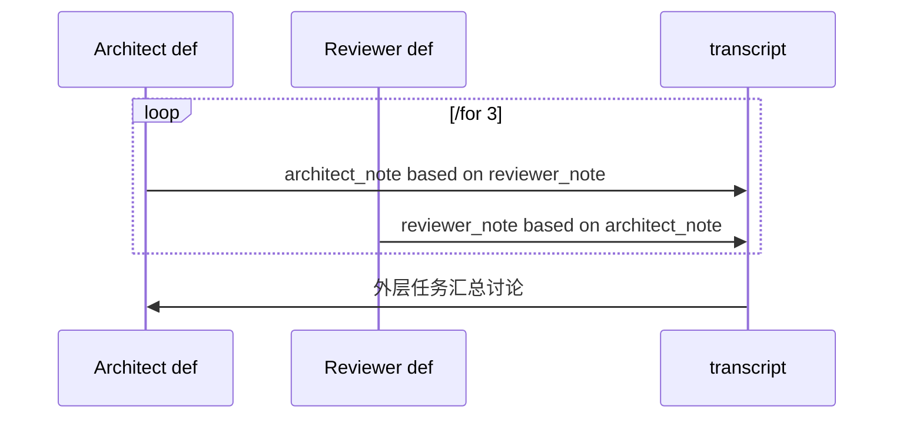

# 7. 设计模式与完整例子

这一章不是命令清单，而是一些可以直接复制改造的 ATM 工作流模式。它们覆盖审查、讨论、分流、汇总、门禁和可复用定义。

## 模式 1：顺序修复 + 独立审查

适合：先让 agent 修改代码，再并行审查文档和风险。

```txt
运行 go test ./...，修复失败。

/pool reviewer 2

/go reviewer
审查 README，确认安装步骤准确。

/go reviewer
审查 docs/commands.md，确认命令说明准确。

/wait reviewer

总结修复内容、验证结果和文档审查发现。
```

```mermaid
flowchart LR
  A[修复测试] --> B1[/go README 审查]
  A --> B2[/go 命令文档审查]
  B1 --> C[/wait reviewer]
  B2 --> C
  C --> D[总结]
```

## 模式 2：Fan-out / Fan-in 审查

适合：同一类检查要覆盖多个模块。

```txt
/pool reviewer 3

/for area in [api web docs tests] /go reviewer
审查 {{area}} 的发布风险。只报告阻塞项和建议。

/wait reviewer

汇总所有 area 的风险，按阻塞程度排序。
```

要点：

- `/for ... /go` 会为每个循环项启动一个后台分支。
- `-messages N` 会让每个分支在结果块里保留最近 N 条消息。
- 用 `/pool` 限制并发，避免同时启动过多 agent。

## 模式 2A：Planner 输出数组，Worker 动态分发

适合：先让一个 agent 规划子任务，再按规划结果并行执行。

```md
/pool reviewer 4

/def plan_shards

拆分本次发布审查工作。
每个计划包含审查人、负责人、重点问题和相对于 ./result 的写目录。

/return
```schema
plans:[]string:计划
```

## parallel review

/for plan in(/call plan_shards)
/go reviewer
{{plan}}

/wait reviewer

读取 ./result 下的文件，汇总所有 reviewer 结果。
```

## 模式 3：两个 agent 轮流讨论

ATM 当前不会在同一个任务里启动两个不同工具适配器，但可以通过角色化定义，让两个 agent 角色轮流发言，并把上一轮消息作为下一轮输入。

```md
# 双角色设计讨论

/def architect topic reviewer_note

你是架构师。主题是 {{topic}}。

上一轮 reviewer 的意见：
{{reviewer_note}}

提出一个简洁方案，只输出你的下一条发言。

/return {{agent.last_message}}

/def reviewer topic architect_note

你是 reviewer。主题是 {{topic}}。

上一轮 architect 的方案：
{{architect_note}}

指出风险、遗漏和需要澄清的问题，只输出你的下一条发言。

/return {{agent.last_message}}

/def append_turn transcript round speaker message

/return
```
{{transcript}}
```

第 {{round}} 轮 {{speaker}}:
{{message}}

/def discussion topic

/let transcript 主题：{{topic}}
/let reviewer_note none
/for 3
/let architect_note /call architect {{topic}} {{reviewer_note}}
/let transcript /call append_turn {{transcript}} {{n}} Architect {{architect_note}}
/let reviewer_note /call reviewer {{topic}} {{architect_note}}
/let transcript /call append_turn {{transcript}} {{n}} Reviewer {{reviewer_note}}

/return {{transcript}}

## decision

/let transcript /call discussion checkout-release

根据下面的讨论，给出最终决策、风险和下一步：

{{transcript}}
```

流程图：



设计要点：

- 每个角色都是一个 `/def`。
- `discussion` 定义内用 `/for 3` 控制讨论轮次。
- 每轮用 `/return {{agent.last_message}}` 取该角色最后发言。
- 用 `/let transcript /call append_turn ...` 反复更新中间变量。
- `/for` 的同步循环会把 `/let name /call ...` 更新后的变量带到下一轮，所以 `transcript` 和 `reviewer_note` 会逐轮累积。
- 第一版调用参数按空白分隔；传递长文本时，用 `{{transcript}}`、`{{architect_note}}` 这种单个模板参数传入。

## 模式 4：并行辩论 + 主任务裁决

适合：想要多个独立观点，但不需要轮流对话。

```md
/def argue_for topic

你支持这个方案：{{topic}}。
给出最强理由和前提条件。

/return {{agent.last_message}}

/def argue_against topic

你反对这个方案：{{topic}}。
给出最强反对理由和失败场景。

/return {{agent.last_message}}

## decision

/let pro /call argue_for checkout-cache
/let con /call argue_against checkout-cache

基于正反观点做决策：

支持方：
{{pro}}

反对方：
{{con}}

输出：结论、需要验证的假设、最小下一步。
```

这个模式比 `/go` 更容易把返回值用于最终 prompt，因为 `/let ... /call` 是同步调用。

## 模式 5：结构化门禁

适合：你需要机器可读的 yes/no 和原因。

````md
/def release_gate area

/output gate-{{area}}
```
passed:boolean:是否通过
reason:string:原因
blocking_items:string:阻塞项
```

检查 {{area}} 是否满足发布条件。

## release_decision

/let api /call release_gate api
/let docs /call release_gate docs

根据以下门禁结果给出发布建议：

API passed={{api.passed}} reason={{api.reason}}
Docs passed={{docs.passed}} reason={{docs.reason}}
````

要点：

- Definition 必须显式写 `/return`；结构化 `/output` 只保存文件产物，不作为返回值 fallback。
- 结构化字段可以用 `{{api.passed}}`、`{{api.reason}}` 访问。
- JSON 文件也会保存在 output 目录，便于审计。

## 模式 6：工作流库

适合：多个项目复用同一批定义。

`workflows/review.todo.md`：

```md
/def risk_review area

审查 {{area}} 的发布风险，按阻塞程度排序。

/return {{agent.last_message}}
```

业务 todo：

```txt
/import review from workflows/review.todo.md

/let api_risk /call review.risk_review api

根据风险审查写发布建议：
{{api_risk}}
```

规则：

- import 只导入 definitions，不执行被导入文件里的普通任务。
- 命名空间可以避免多个库里的定义重名。
- 跨文件递归调用会在 plan/parse 阶段报错。

## 模式 7：运行中追加任务

适合：ATM 还有任务正在执行时，你临时追加后续任务。

启动：

```sh
atm run -file todo.txt -output .atm/live-run
```

另一个终端追加：

```sh
atm append -file todo.txt "审查刚刚生成的 result.md，提取风险。"
```

ATM 运行中会把原 todo 文件移动到活跃临时路径；`append -file todo.txt` 会自动解析活跃文件并追加。

边界很重要：

- 如果当前 `atm run` 仍有任务在执行，追加内容会写入活跃文件；当前任务完成后，主循环会重新扫描并执行追加任务。
- 如果当前 `atm run` 已经执行完并退出，`append` 只会写入原 todo 文件，不会自动启动新 run；需要再次执行 `atm run -file todo.txt`。
- ATM 当前不是常驻文件 watcher。`append` 是“运行中追加队列”，不是“后台守护进程”。

## 模式 8：只读检查与写操作分离

适合：降低并发写冲突。

```txt
/pool reader 4

/for area in [api docs tests observability] /go reader
只读审查 {{area}}，不要修改文件。只报告建议。

/wait reader

根据所有审查建议，统一修改文件并运行验证。
```

设计原则：

- 并行任务尽量只读。
- 修改文件的任务放在 `/wait` 后顺序执行。
- 这样结果块和文件变更都更容易追踪。

## 模式 9：有限重试 + 结构化说明

适合：让 agent 多次尝试，但最终产出稳定报告。

````txt
/for 3 until tests pass
/output verification
```
passed:boolean:测试是否通过
summary:string:验证摘要
remaining:string:剩余问题
```

运行测试并修复失败。
读取最近测试结果，提交结构化验证报告。
````

## 模式 10：并行黑板 + 只读汇总

适合：多个后台 agent 需要写共享发现，但最终汇总任务不应该改写原始发现。

```txt
/db new review_board scope:global persist:run access:append
并行 reviewer 追加发现。Key 使用 findings/<area> 和 questions/<area>。

/pool reviewer 3

/for area in [api docs tests] /go reviewer
审查 {{area}}。把阻塞发现追加到 review_board 的 findings/{{area}}，把待确认问题追加到 questions/{{area}}。

/wait reviewer

/db access review_board read
读取 review_board 中 findings/** 和 questions/**，汇总发布风险和待确认问题。
```

设计要点：

- 声明用 `access:append`，并行分支只能追加，避免覆盖已有内容。
- 汇总任务用 `/db access review_board read` 明确降权，防止汇总时改写审查记录。
- `persist:run` 让黑板进入本次 output 目录，适合和 `result.md`、JSONL 一起归档。

## 模式 11：项目记忆 + 任务级降权

适合：跨多次 run 保存项目事实，但大多数任务只应该读取它。

```txt
/db new release_memory scope:global persist:project access:write
长期发布记忆。Key 使用 memory/<topic>，只记录仍然有效的事实。

根据当前仓库更新 release_memory 的 memory/rollback 和 memory/support。

/db access release_memory read
基于 release_memory 生成本次发布 checklist。不要修改记忆库。
```

设计要点：

- 维护任务保留 `write` 权限，用来替换过期 key。
- 普通消费任务降为 `read`。
- 如果要允许清理废弃 key，把声明改成 `access:admin`，并只在清理任务里保留 admin 权限。

## 模式 12：发布协作 Runbook

适合：一次发布前需要预检、并行审查、集中修复、验证和发布说明归档，并且希望主文档同时是协作看板。

````md
# 支付服务 v2.4 发布协作

建议先预览启动时快照：

```sh
atm plan release.md
atm exec release.md
```

/let service payments-service
/let branch release/v2.4
/let test go test ./...
/let frontend npm --prefix web/frontend test
/let build go build -buildvcs=false ./...
/let review_policy 优先做小而清晰、便于审查的修改。除非当前任务明确要求，不要改变公开 API。

## 环境预检

/for 2 until 工作区已经可以开始发布准备
/args --yolo
确认 Go、Node、npm 和 git 可用。
运行 `{{test}}`、`{{frontend}}` 和 `{{build}}`。
如果因为依赖缺失失败，只报告缺失前置条件，不做无关修改。

## 后端包级发布检查

/pool reviewer 4

/for dir in dirs() /go reviewer /for 3 until {{dir}} 没有后端发布阻塞问题
/args --yolo
{{review_policy}}

审查后端包或顶层目录 `{{dir}}` 是否存在发布阻塞问题。
只修复明确归属 `{{dir}}` 的问题，并运行相关的最小 Go 测试命令。

## 前端重点区域审查

/for area in [checkout dashboard settings] /go reviewer
审查 React 前端区域 `{{area}}`。
保持 UI 修改聚焦且符合现有设计系统；如果有相关测试就运行该测试，否则运行 `{{frontend}}`。

## 等待并整理并行审查

/wait reviewer
等待所有后端包级审查和前端区域审查完成。
如果某个分支发现明确发布阻塞问题，且继续执行同一 pool 中的其他审查没有价值，请请求取消这些审查并说明原因。

整理：

- 已完成的审查范围。
- 发现的发布阻塞问题。
- 被取消或跳过的工作。
- 下一步应该由哪个任务处理。

## 跨模块修复

/resume /for 3 until 完整验证通过
/args --yolo
只把前面章节的报告当作历史上下文。当前任务必须独立完成。

修复前置报告中发现的跨模块发布阻塞问题。
通过前必须运行 `{{test}}`、`{{frontend}}` 和 `{{build}}`。

## 发布说明最终化

/for 2 until 发布说明准确且完整
/let notes_target docs/releases/v2.4.md
最终整理 `{{notes_target}}`。
只把已完成报告作为证据，不要编造没有发生过的修改。
````

设计要点：

- `exec` 在启动时冻结 task block 集合，适合发布、CI 和可复现的一次性批处理；`run` 更适合边执行边追加任务的现场协作。
- 全局 `/let` 保存服务名、分支、测试命令和审查策略，后续任务用模板引用，避免多个 prompt 中重复维护同一事实。
- `/pool reviewer 4` 限制并行审查数量；`/for ... /go reviewer` 把目录和前端区域展开为后台分支。
- 带 prompt 的 `/wait reviewer` 不是单纯阻塞，它会启动协调 agent 汇总后台分支、失败和取消建议。
- 跨模块修复放在 `/wait` 之后串行执行，避免多个 agent 同时修改共享文件。
- 发布说明只使用已完成报告作为证据；如果前置验证失败，发布说明任务应该保留风险，而不是补写不存在的结果。

主文档只保留轻量状态块，详细日志、结构化事件和最终快照进入 output 目录。典型审计结构是：

```txt
.atm/
  state.json
  reports/
    release-notes-final.md
  logs/
    release-notes-final-run-001.log
```

状态块由 ATM 拥有，可以整体替换；删除状态块等价于请求重新评估该 task block。`atm check` 会检查主文档状态块、`.atm/state.json` 和 `.atm/reports/` 的基本一致性，缺失的详细报告或孤儿报告会作为 warning 输出。

详细报告建议记录：

```md
# ATM Report: 发布说明最终化

- Source: `release.md#发布说明最终化`
- Status: Running
- Prompt hash: `sha256:...`

## Plan

For N in [0 1] until "发布说明准确且完整"

## Runs

### Run 1

- Log: `../logs/release-notes-final-run-001.log`
- Check: pending
```

## 模式选择表

| 目标 | 推荐模式 |
| --- | --- |
| 一组顺序修复 | 顺序任务 |
| 多模块独立审查 | Fan-out / Fan-in |
| 两种观点交替讨论 | 两个 agent 轮流讨论 |
| 正反观点裁决 | 并行辩论 + 主任务裁决 |
| 需要机器可读结果 | 结构化门禁 |
| 跨任务共享发现 | 并行黑板 + 只读汇总 |
| 跨 run 保存项目事实 | 项目记忆 + 任务级降权 |
| 发布预检、并行审查、集中修复和发布说明 | 发布协作 Runbook |
| 多项目复用流程 | 工作流库 import |
| 运行中追加后续工作 | `atm append`，前提是当前 `atm run` 尚未退出 |
| 降低并发写冲突 | 只读并行，写入串行 |
