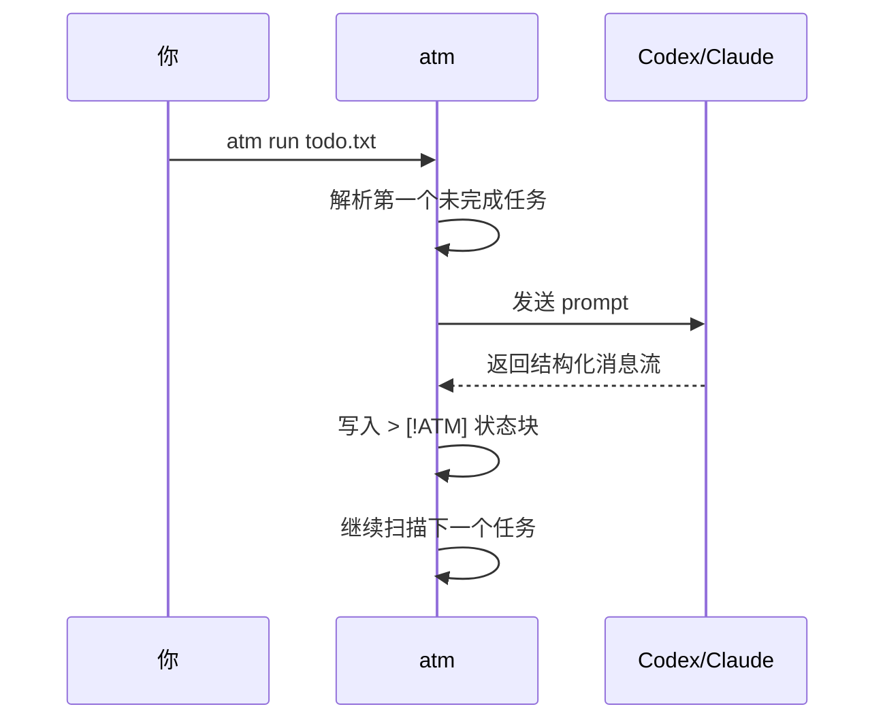

# 1. 快速开始

ATM 是 Agent Task Markdown。你可以先把它当成一个 Markdown 任务文件执行器：普通段落是发给 agent 的任务，斜杠命令控制循环、并行、条件和输出。

## 安装

在仓库根目录构建：

```sh
go build -o atm ./cmd/atm
```

运行时默认使用 `codex`：

```sh
./atm todo.txt
```

如果要使用 Claude Code：

```sh
./atm -tool claude todo.txt
```

可执行文件不在 `PATH` 中时，显式指定路径：

```sh
./atm -codex /path/to/codex todo.txt
./atm -tool claude -claude /path/to/claude todo.txt
```

## 第一个 atm 文件

创建 `todo.txt`：

```txt
运行 go test ./...，修复失败。

/for 3 until tests pass
继续修复，直到测试通过。

/go
审查 README，找出安装说明不清楚的地方。

/wait

总结本次修改和验证结果。
```

执行：

```sh
./atm run todo.txt
```

也可以省略 `run`：

```sh
./atm todo.txt
```

`run` 是 live/rescan 模式：只要当前执行还没有结束，ATM 会继续重扫活跃工作副本。此时对源 todo 路径执行 `atm append` 会自动解析到 active 工作文件，新增 task block 可以被同一次执行拾取；如果当前 run 已经结束，`append` 会写入源文件，留到下次 `atm run` 执行。

源 atm 文件必须显式传入。没有传文件时，ATM 会提示用法，不会自动查找 `todo.txt`、`todo.md` 或 `toto.md`。

## 发生了什么



执行完成后，`~/.atm/runs/<run-id>/result.todo.md` 会出现生成状态块：

```txt
运行 go test ./...，修复失败。
> [!ATM]
> status: done
> started: 2026-05-21 10:00
> finished: 2026-05-21 10:02
> duration: 2m
> runs: 1x
>
> messages:
> - assistant (codex):
>   已修复测试失败。
```

## 预览计划

执行前可以先看计划：

```sh
./atm check --plan todo.txt
```

输出会展示每个任务的 IR 流程，例如：

```txt
task 2:
  flow: For(n in [0 1 2]) -> Execute
  prompt: 继续修复，直到测试通过。
```

## 产物目录

每次直接运行默认写入 `~/.atm/runs/<run-id>/`：

```txt
~/.atm/runs/20260521-103000-a1b2c3d4/
  manifest.json
  sources/
    todo.txt
  work/
    todo.txt
  result.todo.md
  tasks/
    <task-id>/
      report.md
      logs/
  outputs/
```

手动指定目录：

```sh
./atm run todo.txt -output .atm/release-check
./atm run todo.txt -o .atm/release-check
```

`result.todo.md` 是执行结束时带状态的 todo 快照；原始源文件会在退出时恢复为执行前内容。每个任务的详细报告和日志在 `tasks/<task-id>/` 下。
