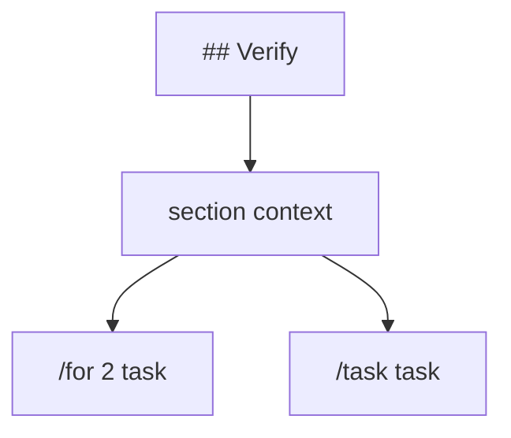

# 2. atm 文件与任务边界

ATM 是 Agent Task Markdown，核心输入是一份 Markdown/纯文本任务文件。两者使用同一套 Markdown-native 解析路径：普通文本和 Markdown 会作为背景上下文保留，任务由 `/task`、任务启动控制命令，或带 prompt 的 task header 命令切分。

## 任务边界

纯文本文件按文档解析：普通文本是背景上下文；可执行任务从 `/task`、任务启动控制命令，或带 prompt 的 task header 命令开始。要执行普通提示词，显式写 `/task`：

```txt
/task
第一个任务。

/task
第二个任务。

/go
第三个任务，后台运行。
```

空行会保留在当前任务 prompt 中。只有当空行后的下一行是根层任务启动/control 命令，或文档遇到同级/更高级 heading、report block、文件结束时，当前任务才会结束。

## 注释与分隔线

任务文件和 `//` task-list section 中，以下整行内容会被忽略：

```txt
# 整行注释
   # 前面有空格也可以
<!-- HTML 注释 -->
[//]: # (Markdown 引用式注释)
[comment]: <> (Markdown 引用式注释)
---
===
```

注意：只识别整行注释。下面这行不是注释，`#` 会作为 prompt 内容发送：

```txt
请解释 package # 这里仍然是 prompt 内容
```

## Markdown 任务文档

Markdown heading 不启动任务。普通 Markdown 会保留在文件中，并作为所在 section 内任务的上下文。需要执行完全没有 header/control 命令的普通文本时，显式写 `/task`。如果任务开头已经有 `/let`、`/args`、`/cd`、`/output`、`/db use`、`/skill use`、`/webhook` 等 task header 命令并跟随 prompt，这个块本身就是任务；如果只有 `/let`、`/flag`、`/webhook new` 等声明而没有 prompt，它只是当前 Markdown scope 内后续任务可见的声明块或文档级声明。

Task header 命令可以写在同一行，也可以拆成多行。配置命令会合并到当前任务，流程命令按出现顺序执行。

参数内容如果长得像命令，需要用引号包住，例如 `/bash` 消息里的 `"/task"`。带 fenced schema 的 `/output` 或带 fenced payload 的 `/webhook` 要单独写在一条 header 行上。

```md
# 发布背景

这里是说明文字，不执行。

/for 2
运行 go test ./...，修复失败。

/task
运行 go vet ./...，修复可操作问题。

## Discuss

/task
这里是一个普通任务 prompt。
```

### 显式上下文与私有文档

默认情况下，任务会看到所在 section 的普通 Markdown 上下文。需要引用远处 section 时，在 task header 中写 `/context #Heading`：

```md
# Database Rules

所有迁移必须可回滚。

# Fix Migration

/context #Database Rules /task
修复最新 migration。
```

如果某段说明只是给人看的草稿、运行方法或敏感备注，不希望进入 agent 默认上下文，用 `/doc` 写成行内说明或 fenced block：

````md
# Internal Notes

/doc 这里不会进入后续 task 的默认上下文。

/doc
```
这里也不会进入默认上下文，也不会被 `/context #Internal Notes` 展开。
```
````

## Heading 与任务的关系

| 写法 | 语义 |
| --- | --- |
| `# Title` | 建立文档 section 和上下文 |
| `/task` | 从这里开始一个普通任务 |
| `/for`、`/go`、`/call`、`/webhook` 等 | 从这里开始带控制流或前置动作的任务 |
| 更深层 heading | 默认属于当前 task prompt；其中出现任务启动命令时，创建 child-heading task |



child-heading task 会继承父任务 root prompt、父任务 header 中的 `/let` 绑定，以及自己所在 heading 路径上的普通 Markdown；不会继承 sibling child-heading 的正文或任务。继承到的 lazy provider 在 child task invocation 内解析并缓存，不和 parent 共享缓存；child section 中的同名 `/let` 会遮蔽父 task header 的值。

```md
# Review

/task
Review backend.

### Scope1

API and migrations.

/for 2
Fix tests {{n}}.

### Scope2

Docs.

/task
Fix docs.
```

这里 `Scope1` 下的 `/for 2` 会看到 `Review backend.` 和 `API and migrations.`；`Scope2` 下的 `/task` 会看到 `Review backend.` 和 `Docs.`，但不会看到 `Scope1` 的正文或任务。

执行时，ATM 会先执行尚未完成的 child-heading task，再执行父任务。父任务运行时会看到已完成子任务的人类可见 `> [!ATM]` report 摘要；被 skipped 的子任务不会嵌入父任务 prompt。

## 命令必须写在任务开头

任务命令只在 prompt 开始前识别：

```txt
/for 3
修复测试。
```

prompt 开始后的 slash 文本不会执行；如果它看起来像 ATM 命令，解析器会报错，要求你把它移动到 task header，或在空行之后作为新的 sibling/child task 开始。

```txt
解释下面这行：
/for 3
```

## 格式化

整理生成状态：

```sh
atm format todo.txt
```

格式化会把组合 task header 写成每行一个命令，并保持执行顺序不变。

直接 `run` 默认不把生成状态写回源文件；需要清理生成状态时，通常是对 `~/.atm/runs/<run-id>/result.todo.md` 使用 `atm clean`。
